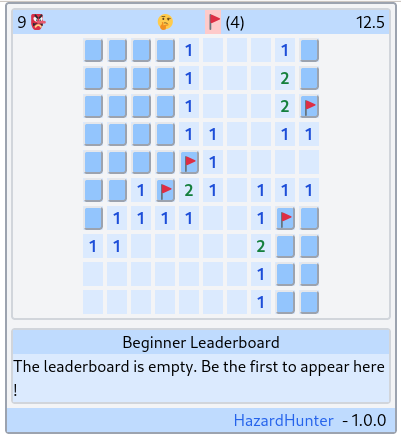

# Takoyaki

Takoyaki is an experiment about Haskell/HTMX WEB SPA(s).

It provides an engine and some demo applications.

Here is the list of available applications:

- HazardHunter -> Play it on [https://hazard-hunter.web-apps.top](https://hazard-hunter.web-apps.top)



- Todolist (WIP)

## Start an application via the nix flake

To run an app (for instance the HazardHunter app) from the nix flake:

```
nix run github:web-apps-top/takoyaki -- HazardHunter
firefox http://127.0.0.1:8092
```

Or from the local checkout

```
nix run .# -- HazardHunter
firefox http://127.0.0.1:8092
```

## Hack on the code

```Shell
# Enter the nix develop shell
nix develop

# Start ghicd on the Module app you want to hack on
ghcid -W -c 'cabal repl' -r="Apps.Todo.run 8092"
ghcid -W -c 'cabal repl' -r="Apps.HazardHunter.Main.run 8092"

# Open the browser to get interactive feedback
firefox http://127.0.0.1:8092

# Run your code editor in the nix shell
code .
```